# Incident Response & Chaos Engineering Toolkit

[](https://python.org)
[](https://reactjs.org/)
[](https://fastapi.tiangolo.com/)
[](https://docker.com)
[](https://kubernetes.io)
[](https://principlesofchaos.org)
[](https://prometheus.io)
[](https://postgresql.org)
[](https://slack.com)
[](LICENSE)

A comprehensive toolkit for incident response management and chaos engineering experiments to improve system resilience.

## Features

### Incident Response Management
- **Incident Commander Dashboard**: Central command interface for incident management and coordination
- **Runbook Automation**: Automated execution of common incident response procedures and playbooks
- **Communication Hub**: Standardized templates and automated communication workflows
- **Alert Correlation Engine**: Intelligent alert grouping, correlation, and noise reduction
- **Post-Incident Analysis**: Tools for conducting effective post-mortems and root cause analysis
- **War Room Coordination**: Real-time collaboration tools for incident response teams
- **SLA Tracking**: Monitor and track incident SLAs and response times
- **Escalation Management**: Automated escalation policies and on-call rotations

### Chaos Engineering Platform
- **Chaos Experiment Library**: Comprehensive collection of pre-built chaos experiments
- **Safe Experiment Framework**: Controls, safeguards, and circuit breakers for chaos experiments
- **Blast Radius Control**: Precise targeting and impact limitation for experiments
- **Automated Safety Mechanisms**: Real-time monitoring and automatic experiment rollback
- **Experiment Scheduler**: Intelligent scheduling with business hour awareness
- **Hypothesis Testing**: Scientific approach to chaos experiments with measurable outcomes
- **Game Days**: Coordinated disaster recovery exercises and team training
- **Reliability Metrics**: Track and measure system resilience improvements

### Monitoring & Observability
- **Real-time Dashboards**: System health and experiment impact visualization
- **Custom Metrics**: Business and technical metrics collection during incidents
- **Distributed Tracing**: Track requests and dependencies during chaos experiments
- **Log Analysis**: Automated log analysis for incident investigation
- **SRE Metrics**: Track MTTR, MTBF, error budgets, and SLO compliance

## Architecture

### System Architecture Overview

```mermaid
graph TB
    subgraph "User Interface Layer"
        Dashboard["📊 Incident Commander<br/>React Dashboard"]
        ChaosUI["🌀 Chaos Control Panel<br/>Experiment Management"]
        Mobile["📱 Mobile App<br/>On-call Response"]
        CLI["⌨️ CLI Tools<br/>Automation Scripts"]
    end

    subgraph "API Gateway Layer"
        APIGateway["🚪 API Gateway<br/>Authentication & Routing"]
        RateLimiter["⌚ Rate Limiter<br/>Request Control"]
    end

    subgraph "Incident Response Services"
        IncidentManager["🚨 Incident Manager<br/>Lifecycle Management"]
        RunbookEngine["📃 Runbook Engine<br/>Automation Executor"]
        AlertCorrelator["🔗 Alert Correlator<br/>Event Processing"]
        CommunicationBot["🤖 Communication Bot<br/>Slack/Teams Integration"]
        PostMortem["🔍 Post-Mortem Tool<br/>Analysis & Reporting"]
    end

    subgraph "Chaos Engineering Services"
        ExperimentController["⚙️ Experiment Controller<br/>Chaos Orchestration"]
        SafetyController["🛡️ Safety Controller<br/>Safeguards & Rollback"]
        TargetSelector["🎯 Target Selector<br/>Blast Radius Control"]
        ExperimentLibrary["📚 Experiment Library<br/>Chaos Patterns"]
        GameDayOrchestrator["🎮 Game Day Orchestrator<br/>Disaster Simulations"]
    end

    subgraph "Data & Storage Layer"
        PostgreSQL[("🐘 PostgreSQL<br/>Incident Data")]
        Redis[("⚡ Redis<br/>Cache & Sessions")]
        InfluxDB[("📈 InfluxDB<br/>Metrics & Events")]
        S3[("🗄️ Object Storage<br/>Artifacts & Logs")]
    end

    subgraph "Monitoring & Observability"
        Prometheus["📉 Prometheus<br/>Metrics Collection"]
        Grafana["📊 Grafana<br/>Visualization"]
        Jaeger["🔍 Jaeger<br/>Distributed Tracing"]
        ELKStack["📦 ELK Stack<br/>Log Aggregation"]
    end

    subgraph "External Integrations"
        AlertSources["📡 Alert Sources<br/>PagerDuty, Datadog, etc."]
        CloudAPIs["☁️ Cloud APIs<br/>AWS, GCP, Azure"]
        ChatOps["💬 ChatOps<br/>Slack, Teams, Discord"]
        ITSM["🏢 ITSM<br/>Jira, ServiceNow"]
        OnCallSystems["📦 On-Call Systems<br/>Opsgenie, VictorOps"]
    end

    %% Connections
    Dashboard --> APIGateway
    ChaosUI --> APIGateway
    Mobile --> APIGateway
    CLI --> APIGateway

    APIGateway --> RateLimiter
    RateLimiter --> IncidentManager
    RateLimiter --> ExperimentController

    IncidentManager --> RunbookEngine
    IncidentManager --> AlertCorrelator
    IncidentManager --> CommunicationBot
    IncidentManager --> PostMortem

    ExperimentController --> SafetyController
    ExperimentController --> TargetSelector
    ExperimentController --> ExperimentLibrary
    ExperimentController --> GameDayOrchestrator

    IncidentManager --> PostgreSQL
    ExperimentController --> PostgreSQL
    RunbookEngine --> Redis
    SafetyController --> InfluxDB
    PostMortem --> S3

    Prometheus --> InfluxDB
    Grafana --> Prometheus
    Jaeger --> S3
    ELKStack --> S3

    AlertCorrelator --> AlertSources
    ExperimentController --> CloudAPIs
    CommunicationBot --> ChatOps
    IncidentManager --> ITSM
    IncidentManager --> OnCallSystems

    style Dashboard fill:#e3f2fd
    style ExperimentController fill:#ffebee
    style SafetyController fill:#e8f5e8
    style PostgreSQL fill:#f3e5f5
```



### Incident Response Workflow


### Chaos Engineering Experiment Flow

```mermaid
flowchart TD
    A["🎯 Define Hypothesis<br/>What could go wrong?"] --> B["📋 Create Experiment Plan<br/>Define scope & metrics"]
    
    B --> C["🛡️ Safety Checks<br/>Verify safeguards"]
    C --> D{"✅ Safety Approved?"}
    
    D -->|No| E["❌ Experiment Rejected<br/>Address safety concerns"]
    D -->|Yes| F["📈 Baseline Metrics<br/>Record normal state"]
    
    F --> G["🚀 Execute Experiment<br/>Inject controlled failure"]
    G --> H["👁️ Monitor Impact<br/>Real-time observation"]
    
    H --> I{"🚨 Safety Breach?"}
    I -->|Yes| J["🔄 Automatic Rollback<br/>Stop experiment"]
    I -->|No| K{"⏰ Duration Complete?"}
    
    K -->|No| H
    K -->|Yes| L["🔄 Clean Rollback<br/>Restore normal state"]
    
    J --> L
    L --> M["📉 Analyze Results<br/>Compare with hypothesis"]
    
    M --> N{"🎯 Hypothesis Valid?"}
    N -->|Yes| O["✅ System Resilient<br/>Document success"]
    N -->|No| P["⚠️ Weakness Found<br/>Create improvement plan"]
    
    O --> Q["📄 Generate Report<br/>Share learnings"]
    P --> R["🔧 Implement Fixes<br/>Address vulnerabilities"]
    
    R --> Q
    Q --> S["📅 Schedule Follow-up<br/>Regular resilience testing"]
    
    E --> B
    
    style A fill:#e3f2fd
    style D fill:#f3e5f5
    style I fill:#ffebee
    style O fill:#e8f5e8
    style P fill:#fff3e0
```



### Security & Compliance Framework


### File Structure

```
├── incident-response/
│   ├── commander/              # Incident command dashboard
│   │   ├── frontend/          # React dashboard
│   │   ├── api/               # Dashboard API
│   │   └── mobile/            # Mobile app
│   ├── runbooks/              # Automated runbooks
│   │   ├── library/           # Runbook templates
│   │   ├── engine/            # Execution engine
│   │   └── validators/        # Safety validators
│   ├── communication/         # Communication tools
│   │   ├── bot/               # Slack/Teams bot
│   │   ├── templates/         # Message templates
│   │   └── channels/          # Communication channels
│   ├── analysis/              # Post-incident analysis
│   │   ├── postmortem/        # Post-mortem tools
│   │   ├── timeline/          # Timeline generator
│   │   └── reports/           # Report generator
│   └── correlation/           # Alert correlation
│       ├── engine/            # Correlation logic
│       ├── rules/             # Correlation rules
│       └── ml/                # ML-based correlation
├── chaos-engineering/
│   ├── experiments/           # Chaos experiment library
│   │   ├── infrastructure/    # Infra experiments
│   │   ├── application/       # App-level experiments
│   │   ├── network/           # Network chaos
│   │   └── database/          # Database experiments
│   ├── framework/             # Core chaos framework
│   │   ├── controller/        # Experiment controller
│   │   ├── safety/            # Safety mechanisms
│   │   └── reporting/         # Results analysis
│   ├── scheduler/             # Experiment scheduling
│   │   ├── cron/              # Scheduled experiments
│   │   ├── triggers/          # Event-based triggers
│   │   └── gameday/           # Game day orchestration
│   └── targets/               # Target system management
│       ├── kubernetes/        # K8s target management
│       ├── cloud/             # Cloud resource targeting
│       └── services/          # Service targeting
├── shared/
│   ├── monitoring/            # Monitoring integrations
│   │   ├── prometheus/        # Prometheus integration
│   │   ├── grafana/           # Grafana dashboards
│   │   └── alertmanager/      # Alert configuration
│   ├── notifications/         # Notification services
│   │   ├── slack/             # Slack integration
│   │   ├── email/             # Email notifications
│   │   ├── sms/               # SMS alerts
│   │   └── webhooks/          # Webhook handlers
│   ├── security/              # Security components
│   │   ├── auth/              # Authentication
│   │   ├── rbac/              # Authorization
│   │   └── audit/             # Audit logging
│   └── metrics/               # Metrics collection
│       ├── collectors/        # Metric collectors
│       ├── processors/        # Data processing
│       └── exporters/         # Data exporters
└── deployment/
    ├── docker/                # Container configurations
    │   ├── incident-response/ # IR containers
    │   ├── chaos-engineering/ # Chaos containers
    │   └── shared/            # Shared containers
    ├── kubernetes/            # K8s manifests
    │   ├── namespaces/        # Namespace definitions
    │   ├── deployments/       # Application deployments
    │   ├── services/          # Service definitions
    │   ├── ingress/           # Ingress configurations
    │   └── monitoring/        # Monitoring stack
    └── terraform/             # Infrastructure setup
        ├── aws/               # AWS resources
        ├── gcp/               # GCP resources
        ├── azure/             # Azure resources
        └── modules/           # Reusable modules
```

## Quick Start

### Prerequisites
- Docker and Docker Compose
- Python 3.9+
- Node.js 16+
- kubectl (for Kubernetes deployment)

### Installation

1. Clone the repository:
```bash
git clone https://github.com/yourusername/incident-response-toolkit.git
cd incident-response-toolkit
```

2. Start the development environment:
```bash
docker-compose up -d
```

3. Access the Incident Commander Dashboard:
```
http://localhost:3000
```

### Running Chaos Experiments

1. Configure your target systems in `chaos-engineering/config/targets.yaml`
2. Run a basic experiment:
```bash
python chaos-engineering/framework/runner.py --experiment=cpu-stress --duration=60s
```

## Project Structure

### Incident Response Components

- **Commander Dashboard**: React-based web interface for incident management
- **Runbook Engine**: Python-based automation engine for executing response procedures
- **Alert Processor**: Service for processing and correlating alerts from multiple sources
- **Communication Bot**: Slack/Teams integration for automated incident communication

### Chaos Engineering Components

- **Experiment Library**: Collection of chaos experiments targeting different failure modes
- **Safety Controller**: Monitoring and rollback mechanisms for experiments
- **Metrics Collector**: Gathering system metrics during experiments
- **Report Generator**: Automated reporting of experiment results

## Technology Stack

- **Frontend**: React, TypeScript, Material-UI
- **Backend**: Python (FastAPI), Node.js
- **Database**: PostgreSQL, Redis
- **Monitoring**: Prometheus, Grafana
- **Container Orchestration**: Docker, Kubernetes
- **Infrastructure**: Terraform, AWS/GCP/Azure

## Contributing

1. Fork the repository
2. Create a feature branch
3. Add tests for new functionality
4. Ensure all tests pass
5. Submit a pull request

## License

MIT License - see LICENSE file for details

---

**Created by [olaitanojo](https://github.com/olaitanojo)**
