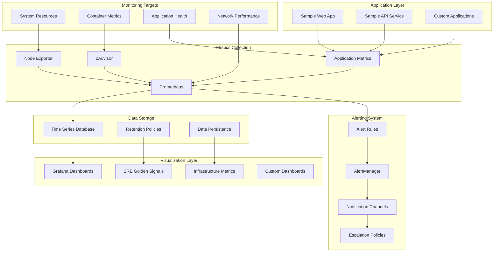
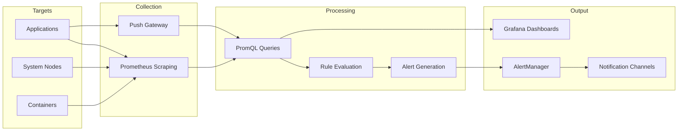
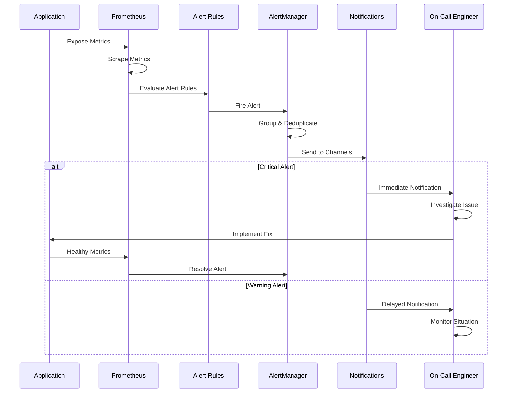
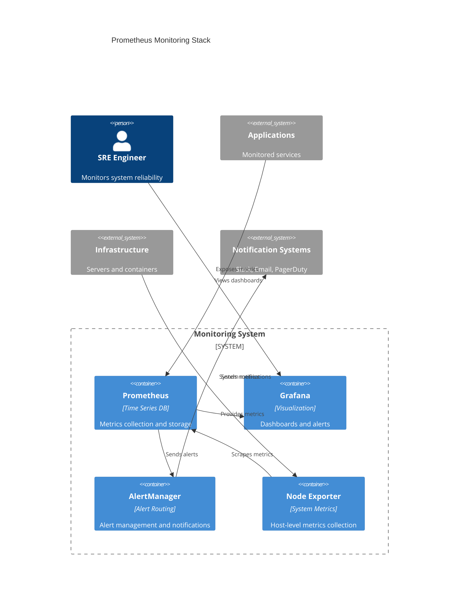

# 📊 SRE Monitoring and Alerting Stack

[](https://prometheus.io/)
[](https://grafana.com/)
[](https://www.docker.com/)
[](https://prometheus.io/docs/alerting/latest/alertmanager/)
[](https://opensource.org/licenses/MIT)

## 🌟 Overview
This project demonstrates a comprehensive monitoring and alerting solution using modern SRE practices. It showcases the implementation of observability, alerting, and incident response capabilities that are essential for maintaining reliable systems in production environments.

## 📋 Table of Contents
- [🏗️ Architecture](#%EF%B8%8F-architecture)
- [🎯 SRE Concepts](#-key-sre-concepts-demonstrated)
- [📊 Metrics](#-metrics-and-monitoring)
- [🚨 Alerting](#-alerting-rules)
- [🚀 Quick Start](#-quick-start)
- [📈 Dashboards](#-dashboard-access)
- [📝 SRE Principles](#-sre-principles-applied)

## 🎯 Key SRE Concepts Demonstrated

- **Observability**: Multi-layer monitoring with metrics, logs, and traces
- **Service Level Objectives (SLOs)**: Error rate and latency monitoring
- **Incident Response**: Automated alerting and escalation
- **Capacity Planning**: Resource utilization tracking
- **Reliability Engineering**: Proactive monitoring and alerting

## 🏗️ Architecture

### System Overview


### Data Flow Architecture


### Alerting Workflow


### Component Architecture


### Monitoring Stack Components

- **Prometheus**: Metrics collection, storage, and alerting engine
- **Grafana**: Visualization platform with rich dashboards and alerting
- **AlertManager**: Alert routing, grouping, and notification management
- **Node Exporter**: System-level metrics collection (CPU, memory, disk, network)
- **cAdvisor**: Container resource usage and performance metrics
- **Sample Applications**: Instrumented web services demonstrating observability

## 📊 Metrics and Monitoring

### Application Metrics
- HTTP request rate and latency
- Error rate and status codes
- Active connections and queue sizes
- Custom business metrics

### Infrastructure Metrics
- CPU, Memory, Disk utilization
- Network I/O and throughput
- Container resource usage
- System load and availability

### SRE Golden Signals
1. **Latency**: Response time percentiles
2. **Traffic**: Request rate and throughput
3. **Errors**: Error rate and count
4. **Saturation**: Resource utilization

## 🚨 Alerting Rules

### Critical Alerts
- Service downtime (>1 minute)
- High error rate (>10% for 2 minutes)
- Critical resource exhaustion

### Warning Alerts
- High CPU usage (>80% for 5 minutes)
- High memory usage (>85% for 5 minutes)
- Elevated response times (>500ms 95th percentile)
- Low disk space (>85% usage)

## 🚀 Quick Start

### Prerequisites
- Docker and Docker Compose
- 8GB+ RAM recommended
- Ports 3000, 8080, 8081, 9090, 9093, 9100, 8082 available

### Launch the Stack
```bash
# Clone the repository
git clone <repository-url>
cd prometheus-monitoring-stack

# Start all services
docker-compose up -d

# View logs
docker-compose logs -f
```

### Access the Services
- **Grafana Dashboard**: http://localhost:3000 (admin/admin123)
- **Prometheus**: http://localhost:9090
- **Alertmanager**: http://localhost:9093
- **Sample App**: http://localhost:8080
- **Sample API**: http://localhost:8081

## 📈 Dashboard Access

1. Open Grafana at http://localhost:3000
2. Login with admin/admin123
3. Navigate to pre-configured dashboards
4. Explore real-time metrics and alerts

## 🔧 Load Testing

Generate traffic to see metrics in action:

```bash
# Install load testing tool
pip install locust

# Run load tests
locust -f load_test.py --host=http://localhost:8080
```

## 📋 Key Files

- `docker-compose.yml`: Service orchestration
- `config/prometheus.yml`: Prometheus configuration
- `config/alerts.yml`: Alerting rules
- `config/alertmanager.yml`: Alert routing
- `dashboards/`: Grafana dashboard definitions
- `sample-app/`: Instrumented web application
- `sample-api/`: Instrumented API service

## 🎓 Learning Outcomes

This project demonstrates:
- Setting up production-grade monitoring
- Implementing SRE best practices
- Creating meaningful alerts and dashboards
- Instrumenting applications for observability
- Managing alert fatigue with proper routing
- Building reliability into systems from the ground up

## 🔄 Next Steps

1. Integrate with cloud provider monitoring (AWS CloudWatch, GCP Monitoring)
2. Add distributed tracing with Jaeger
3. Implement log aggregation with ELK stack
4. Add chaos engineering experiments
5. Create runbooks and incident response procedures

## 📝 SRE Principles Applied

- **Embrace Risk**: Balanced approach to reliability vs. velocity
- **Service Level Objectives**: Quantitative reliability targets
- **Monitoring**: Comprehensive observability strategy
- **Automation**: Automated alerting and response
- **Simplicity**: Clear, maintainable monitoring setup

---

*This project showcases practical SRE skills including monitoring, alerting, observability, and incident response - core competencies for Site Reliability Engineer roles.*

---

**Created by [olaitanojo](https://github.com/olaitanojo)**
